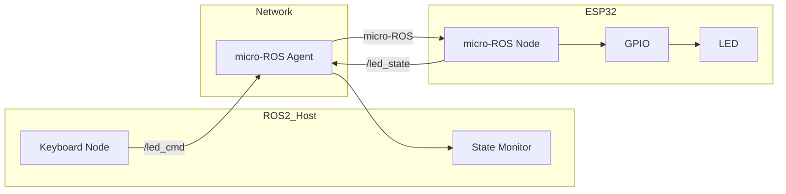
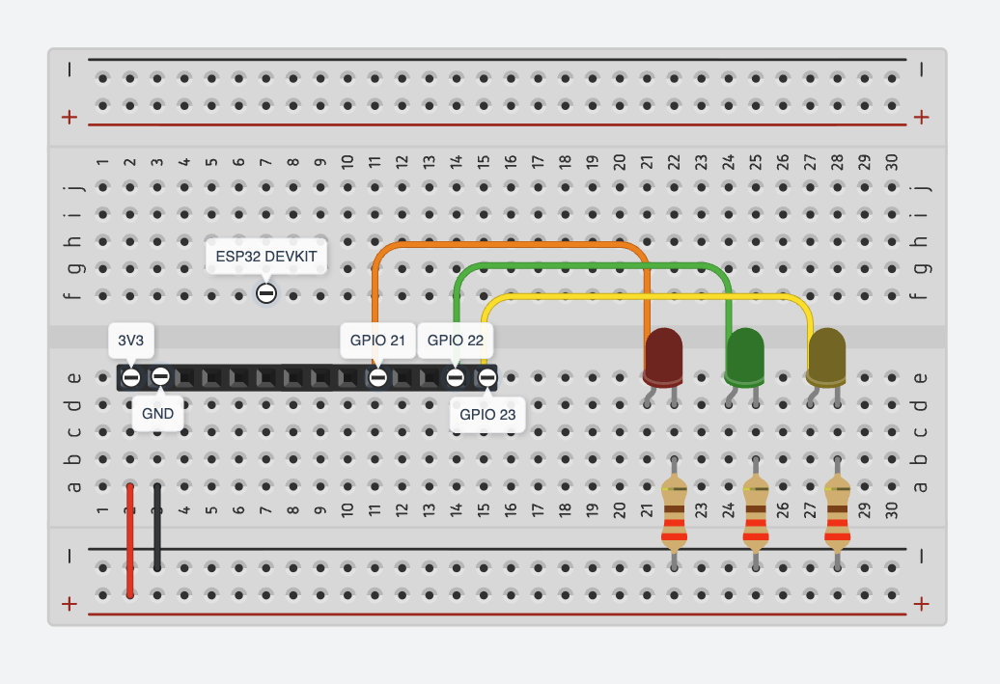
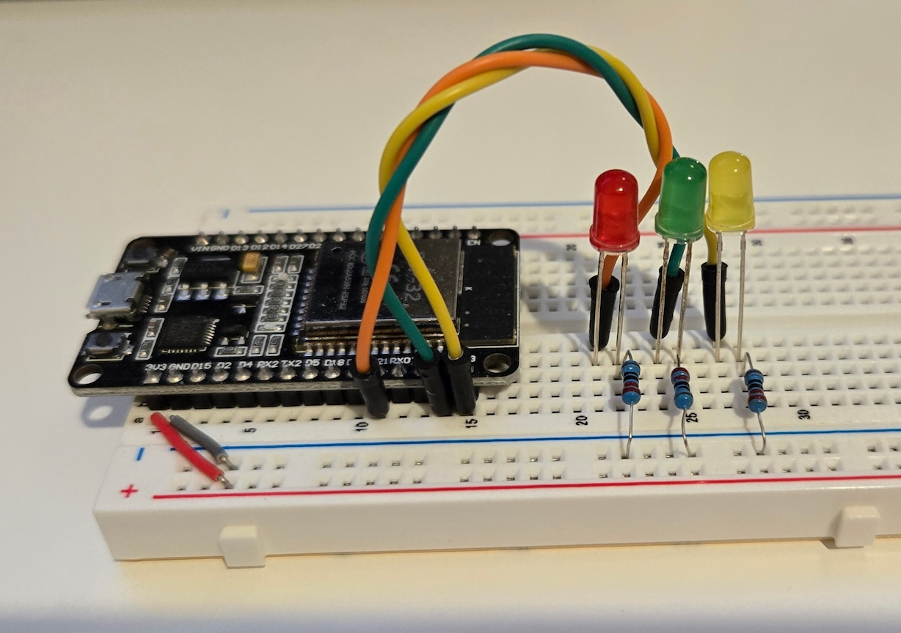
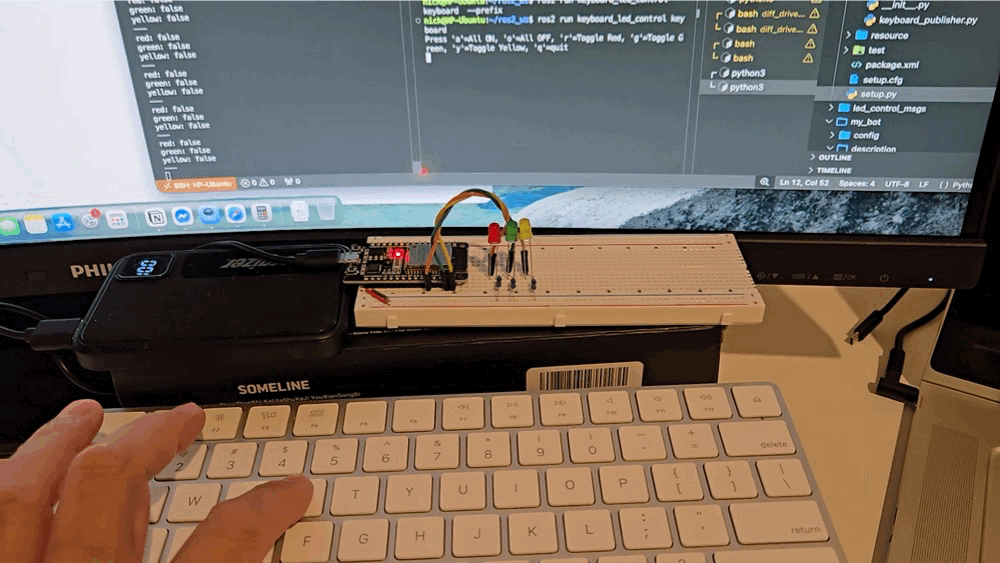

# ROS 2 + micro-ROS ESP32 LED Control

A beginner robotics integration project demonstrating communication between ROS 2 and an ESP32 using micro-ROS.

The system allows keyboard input on a ROS 2 host machine to control an LED connected to an ESP32 in real time.

## Features

- ROS 2 publisher node
- micro-ROS subscriber/publisher on ESP32
- Real-time LED control
- Wi-Fi communication using micro-ROS Agent
- PlatformIO firmware workflow

## System Architecture



## Hardware

- ESP32 Dev Board
- LED
- 220Ω resistor
- Breadboard
- Jumper wires

## Software Stack

- **Operating System**: Ubuntu 22.04 LTS
- **Robotics Frameworks**: ROS 2 Humble, micro-ROS
- **Embedded Development**: PlatformIO
- **Languages**: Python, C/C++

## Folder Structure

```text
firmware/
└── esp32_led_control/

ros2_ws/
└── src/
    ├── keyboard_led_control/
    │   └──  keyboard_publisher.py
    │
    └── led_control_msgs/

docs/
└── diagrams, screenshots, demo GIFs
```

| Package              | Purpose                                                                |
| -------------------- | ---------------------------------------------------------------------- |
| esp32_led_control    | ESP32 micro-ROS firmware that controls the LED and publishes its state |
| keyboard_led_control | ROS2 nodes for sending LED commands and monitoring LED state           |
| led_control_msgs     | Custom message definitions shared between ROS2 and ESP32               |

## Wiring



| ESP32 Pin | Component      |
| --------- | -------------- |
| GPIO21    | Red LED (+)    |
| GPIO22    | Green LED (+)  |
| GPIO23    | Yellow LED (+) |
| GND       | LED (-)        |



## Running the Project

### 1. Start micro-ROS Agent

```bash
docker run -it --rm --net=host microros/micro-ros-agent:humble udp4 --port 8888
```

Or build micor-ROS locally:

Follow steps on https://github.com/micro-ROS/micro_ros_setup#building

then https://github.com/micro-ROS/micro_ros_setup#building-micro-ros-agent

Start the agent with UDP:

```bash
ros2 run micro_ros_agent micro_ros_agent udp4 --port 8888
```

### 2. Flash ESP32 Firmware

```bash
cd firmware/esp32_led_subscriber
pio run --target upload
```

### 3. Build ROS Workspace

```bash
cd ros2_ws
colcon build
source install/setup.bash
```

### 4. Run Keyboard Publisher

```bash
ros2 run keyboard_led_control keyboard
```

## Demo



Watch on YouTube: https://www.youtube.com/watch?v=zEwu73DFQZk

## Lessons Learned

- ROS 2 publisher/subscriber fundamentals, custom messages
- DDS communication concepts
- micro-ROS architecture
- Embedded GPIO control
- Networking between MCU and ROS host
- Debugging distributed robotics systems

## Future Improvements

- Add joystick control
- Add RGB LED support
- ~~Add ESP32 status feedback topic~~ (implemented, topic: /led_state)
- Replace LED with motor driver
- Add Foxglove visualization
- Add launch files
- Add CI/CD with GitHub Actions
